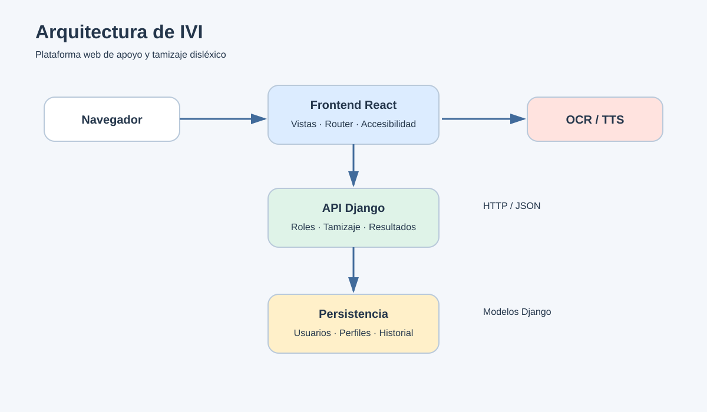
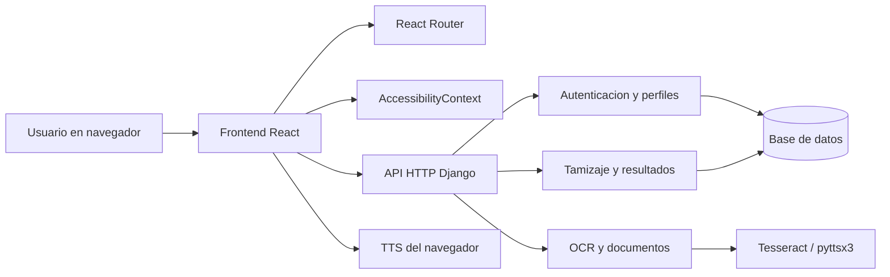

# 1. Arquitectura del sistema

## 1.1 Resumen

IVI utiliza una arquitectura web cliente-servidor. El frontend React presenta las vistas, controla la navegacion y mantiene la configuracion de accesibilidad. El backend Django expone servicios HTTP, autentica usuarios, procesa archivos y persiste resultados en la base de datos.

## 1.2 Capas

| Capa | Responsabilidad | Ubicacion |
|---|---|---|
| Presentacion | Vistas, navegacion, controles y accesibilidad | `frontend/src/js/pages`, `components`, `css` |
| Estado de interfaz | Fuente, tamano, espaciado y tema | `frontend/src/js/context/AccessibilityContext.js` |
| Integracion | Peticiones HTTP, autenticacion y lectura de respuestas | Paginas y servicios frontend |
| API | Rutas, validacion y respuestas JSON | `backend/*/views.py`, `urls.py` |
| Dominio | Usuarios, perfiles, pruebas y resultados | `backend/usuarios/models.py` |
| Procesamiento | Archivos extraidos y conversiones de audio | `backend/archivos/models.py`, `backend/lector` |
| Persistencia | Migraciones y base de datos Django | `backend/usuarios/migrations`, `backend/archivos/migrations` |
| OCR/TTS | Extraccion de texto y generacion de audio | `backend/lector`, `backend/archivos`, Tesseract |

## 1.3 Modulos funcionales

- **Acceso:** inicio, registro y cierre de sesion.
- **Informacion:** Acerca de, Senales y Consejos.
- **Lectores:** lector de documentos, lector de textos, OCR y audio.
- **Tamizaje:** cuestionarios por edad y filtro alfabetico.
- **Juegos:** parejas, silabas, letras, velocidad y ortografia.
- **Resultados:** consulta del historial del usuario.
- **Doctor/profesional:** busqueda de pacientes, evaluacion en consultorio y detalle de resultados.
- **Administrador:** gestion, filtros y mantenimiento de usuarios.

## 1.4 Tecnologias

- React 19 y React DOM.
- React Router 7.
- Create React App / `react-scripts`.
- Django 4.2.
- Django REST Framework.
- Django CORS Headers.
- Pillow, PyPDF2, python-docx y pytesseract.
- Tesseract OCR y pyttsx3.

## 1.5 Seguridad y limites

- Las rutas de administracion y doctor estan protegidas por rol.
- Las peticiones autenticadas usan token almacenado en la sesion del navegador.
- Los resultados validan tipo de prueba y puntaje de 0 a 100.
- Los resultados se asocian a `Paciente`, no directamente a cualquier usuario.
- El catalogo `TipoPrueba` evita repetir nombres y codigos en cada resultado.
- Los datos especificos se separan en `Paciente` y `Profesional`; `Profile` conserva solo identidad y rol.
- Las respuestas de una prueba se separan en `RespuestaResultado` y el lector registra `ArchivoProcesado` y `ConversionAudio`.
- La aplicacion debe ejecutarse con HTTPS y variables de entorno seguras en produccion.
