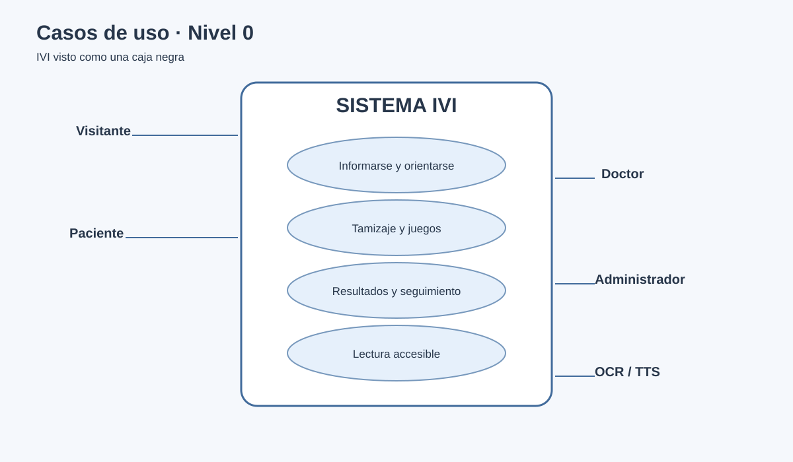
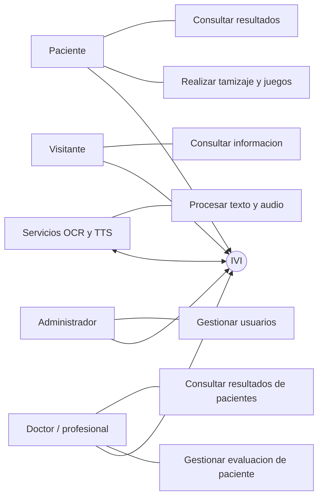

# 2. Casos de uso - Nivel 0

El nivel 0 presenta el sistema como una caja negra y muestra sus actores principales y objetivos generales.

## 2.1 Actores

- **Visitante:** persona que consulta informacion o decide registrarse.
- **Paciente:** usuario que realiza tamizajes, juegos y consulta sus resultados.
- **Doctor/profesional:** especialista que inicia evaluaciones, consulta pacientes y revisa resultados.
- **Administrador:** responsable de gestionar usuarios y revisar informacion administrativa.
- **Servicios externos:** navegador con TTS y Tesseract para OCR.

## 2.2 Diagrama general

## 2.3 Catalogo de nivel 0

| ID | Caso de uso | Actor principal | Resultado |
|---|---|---|---|
| CU-00 | Consultar informacion y consejos | Visitante | Conoce la dislexia y estrategias de apoyo |
| CU-01 | Registrarse e iniciar sesion | Visitante | Obtiene una cuenta de paciente |
| CU-02 | Realizar cuestionario de tamizaje | Paciente | Obtiene un resultado orientativo |
| CU-03 | Realizar juegos de habilidades | Paciente | Registra desempeno en actividades ludicas |
| CU-04 | Consultar resultados propios | Paciente | Revisa historial y puntajes |
| CU-05 | Gestionar evaluacion en consultorio | Doctor/profesional | Asocia una evaluacion a un paciente |
| CU-06 | Consultar resultados de pacientes | Doctor/profesional | Revisa historiales y detalle |
| CU-07 | Administrar usuarios | Administrador | Crea, filtra, edita o elimina usuarios |
| CU-08 | Leer documentos, imagenes o textos | Paciente/visitante | Obtiene texto o audio accesible |
| CU-09 | Personalizar accesibilidad | Todos | Ajusta fuente, tamano, espaciado y tema |

## 2.4 Limite del sistema

IVI orienta y registra indicadores. No reemplaza una evaluacion clinica, psicopedagogica o neurologica profesional.
