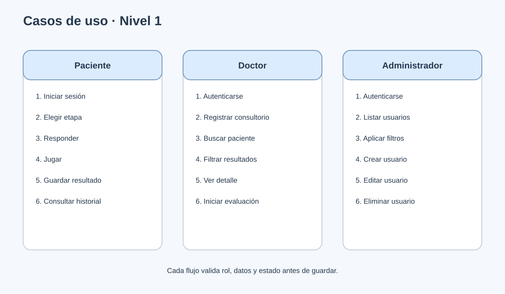
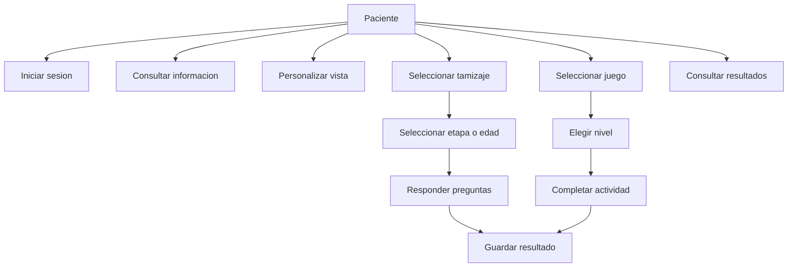
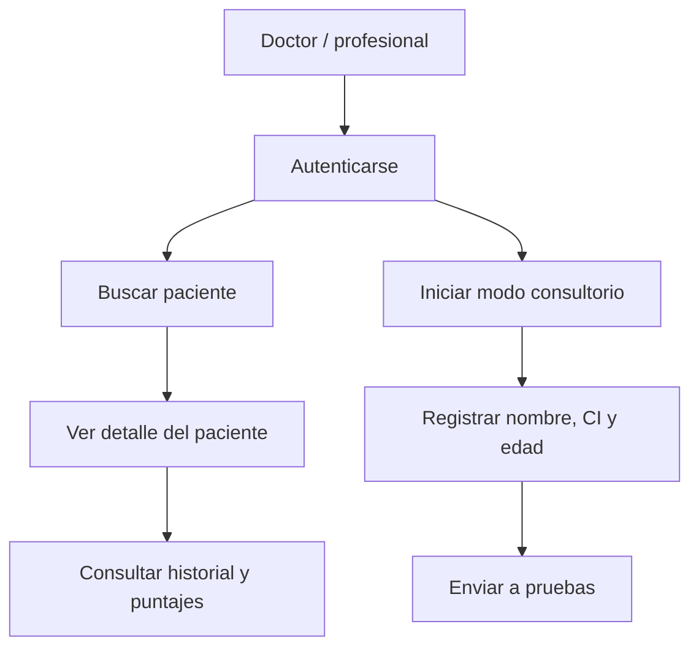
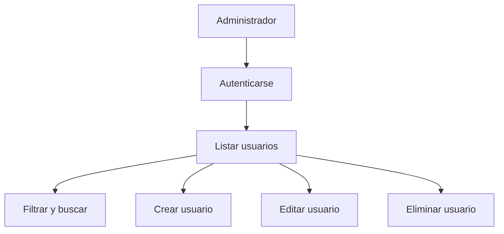

# 3. Casos de uso - Nivel 1

El nivel 1 descompone los casos generales en acciones observables del sistema.

## 3.1 Paciente

### CU-01 Registro e inicio de sesion

- **Precondicion:** el visitante no tiene una sesion activa.
- **Flujo principal:** ingresar datos, validar campos, crear cuenta, iniciar sesion.
- **Alternativas:** usuario duplicado, correo invalido o campos incompletos.
- **Postcondicion:** el sistema identifica al usuario y permite acceder a funciones protegidas.

### CU-02 Tamizaje

- **Precondicion:** sesion iniciada o evaluacion iniciada por doctor.
- **Flujo principal:** elegir etapa, responder preguntas, enviar respuestas, calcular puntaje y guardar resultado.
- **Alternativas:** abandonar o enviar informacion incompleta.
- **Postcondicion:** se muestra un resultado orientativo y queda disponible para seguimiento.

### CU-03 Juegos

- **Precondicion:** acceso a la galeria de juegos.
- **Flujo principal:** filtrar por edad/dificultad, seleccionar juego, elegir nivel, completar rondas, registrar puntaje.
- **Juegos:** Parejas escondidas, Tren de silabas, Lluvia de letras, Velocidad de lectura y Reto de ortografia.
- **Postcondicion:** se muestra el desempeno y, cuando corresponde, se registra el resultado.

## 3.2 Doctor/profesional

- **CU-05 Evaluacion en consultorio:** registra temporalmente el paciente, define edad y abre el flujo de pruebas.
- **CU-06 Seguimiento:** busca por nombre o CI, filtra por tipo/fechas y consulta resultados agrupados.
- **Regla:** solo perfiles con rol doctor o admin pueden consultar informacion protegida.

## 3.3 Administrador

- **CU-07 Gestion de usuarios:** usa paginacion, filtros por rol, CI, fechas, staff y superusuario.
- **Validaciones:** pacientes requieren CI; doctores requieren matricula y especialidad.

## 3.4 Lectura y accesibilidad

- **CU-08 Lectura:** cargar PDF, DOCX, TXT o imagen; extraer texto; generar audio cuando el servicio esta disponible.
- **CU-09 Accesibilidad:** cambiar fuente, tamano, espaciado y tema; la configuracion se conserva en el navegador.
- **TTS del navegador:** la guia de Consejos puede leerse con `speechSynthesis`.
