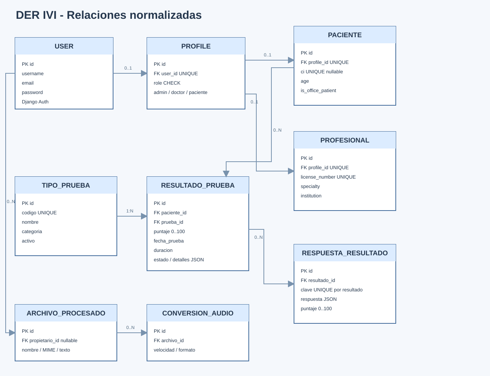
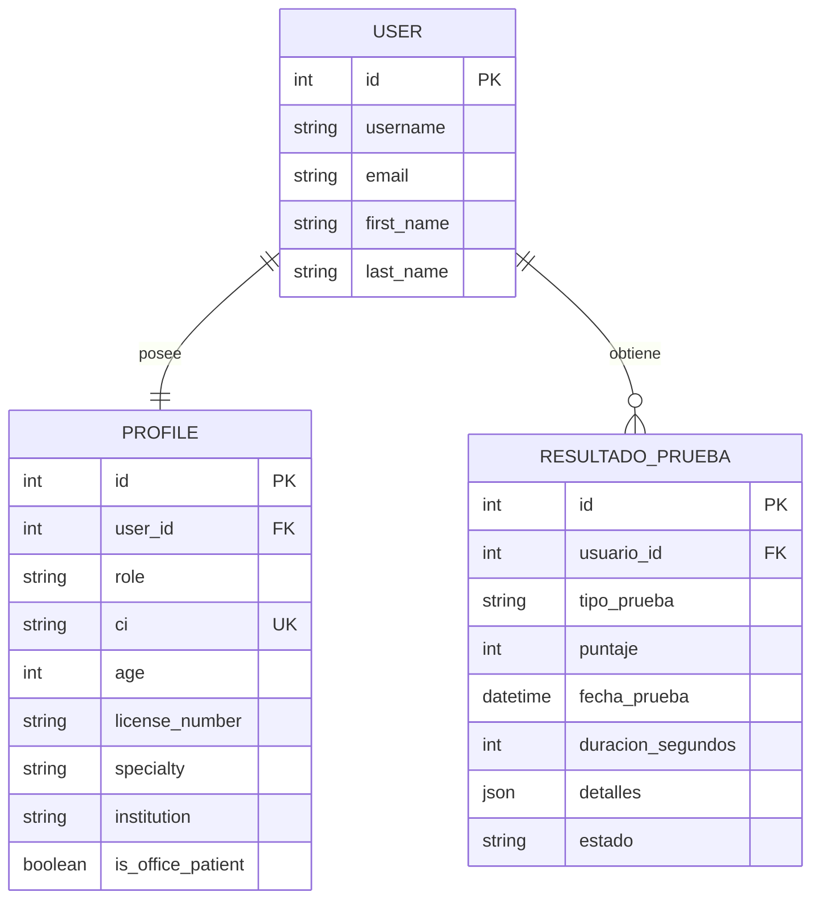

# 4. DER - Modelo entidad relacion

## 4.1 Entidades principales

### User

Entidad de autenticacion provista por Django.

- `id` (PK)
- `username`
- `email`
- `password` almacenada por Django
- `first_name`
- `last_name`

### Profile

Extiende a User con informacion de dominio.

- `id` (PK)
- `user_id` (FK unica a User)
- `role`: admin, doctor o paciente
- `ci` (unica, nullable)
- `age`
- `license_number`
- `specialty`
- `institution`
- `is_office_patient`

### ResultadoPrueba

Registra el desempeno de un cuestionario o juego.

- `id` (PK)
- `usuario_id` (FK a User)
- `tipo_prueba`
- `puntaje` de 0 a 100
- `fecha_prueba`
- `duracion_segundos`
- `detalles` JSON
- `estado`: completada, incompleta o cancelada

## 4.2 Diagrama entidad relacion

## 4.3 Reglas de integridad

- Cada usuario tiene un perfil asociado.
- Un usuario puede tener cero o muchos resultados.
- Si se elimina un usuario, sus resultados se eliminan por la relacion definida en Django.
- El CI es unico cuando se informa.
- El puntaje debe estar entre 0 y 100.
- El tipo de prueba debe pertenecer al catalogo permitido.
- Los resultados pueden registrar detalles variables en JSON para cada juego o cuestionario.

## 4.4 Catalogo actual de tipos

`lectura`, `velocidad`, `comprension`, `ortografia`, `alfabeto`, `parejas`, `silabas` y `letras`.
