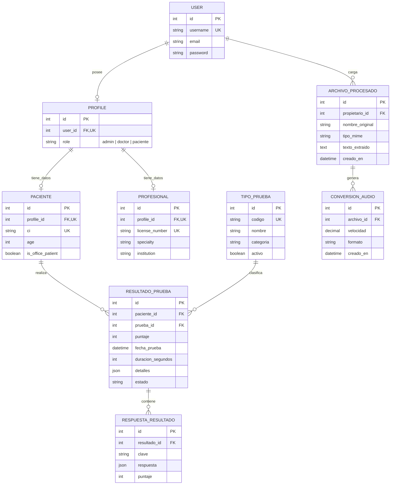

# 4. DER - Modelo entidad relacion

## 4.1 Criterio de organizacion

El modelo separa la identidad comun, los datos especificos por tipo de usuario,
el catalogo de pruebas, los resultados y el procesamiento de archivos. No se
repiten datos de pacientes o profesionales en `Profile`.

El administrador no se modela como una tabla independiente. `Admin` es un rol
de `Profile`, junto con `doctor` y `paciente`; sus credenciales y datos de
acceso se almacenan en `User`, y el rol se almacena en `Profile.role`. Las
tablas internas de autenticacion, permisos y sesiones que Django administra
automaticamente quedan fuera de este DER de dominio.

## 4.2 Tablas del dominio

1. **User**: autenticacion provista por Django.
2. **Profile**: relacion obligatoria con `User`; un usuario puede tener cero o un perfil y el perfil siempre pertenece a un usuario.
3. **Paciente**: CI, edad y si fue atendido en consultorio.
4. **Profesional**: matricula, especialidad e institucion del doctor.
5. **TipoPrueba**: catalogo unico de evaluaciones y juegos.
6. **ResultadoPrueba**: puntaje y estado de una prueba realizada por un paciente.
7. **RespuestaResultado**: respuestas o detalles estructurados de un resultado.
8. **ArchivoProcesado**: archivo recibido y texto extraido por el lector.
9. **ConversionAudio**: conversiones de audio asociadas a un archivo procesado.

## 4.3 Diagrama entidad relacion

## 4.4 Reglas de integridad

- Un usuario puede tener cero o un `Profile`; cada `Profile` pertenece a exactamente un usuario.
- `Paciente.ci` es unico cuando se informa.
- `Profesional.license_number` es unico cuando se informa.
- `Profile.role` solo admite `admin`, `doctor` o `paciente`.
- `TipoPrueba.codigo` es unico y los resultados solo referencian tipos activos al crearse desde la API.
- El puntaje de resultados y respuestas esta entre 0 y 100.
- Un resultado no puede existir sin su paciente y su tipo de prueba.
- Las respuestas se identifican por `resultado` y `clave`, evitando duplicados.
- Un resultado puede tener cero o muchas respuestas; al eliminar un resultado se eliminan sus respuestas.
- Un archivo puede tener cero o muchas conversiones de audio; al eliminarlo se eliminan sus conversiones.
- Al eliminar un tipo de prueba se protegen sus resultados.

## 4.5 Catalogo inicial de tipos

`lectura`, `velocidad`, `comprension`, `ortografia`, `alfabeto`, `parejas`, `silabas` y `letras`.
