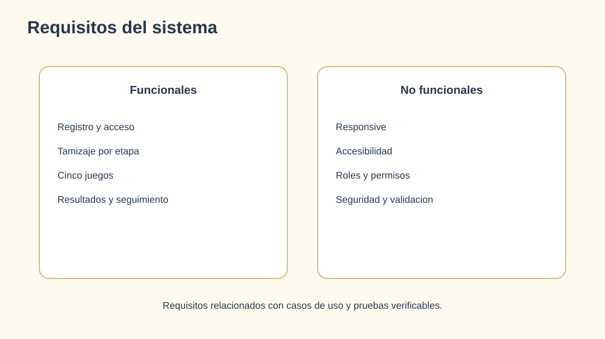

# 5. Requisitos del sistema



## 5.1 Requisitos funcionales

| ID | Requisito | Prioridad |
|---|---|---|
| RF-01 | Permitir registro e inicio de sesion | Alta |
| RF-02 | Gestionar perfiles de paciente, doctor y administrador | Alta |
| RF-03 | Ofrecer cuestionarios de tamizaje por etapa | Alta |
| RF-04 | Ofrecer cinco juegos de habilidades lectoras y cognitivas | Alta |
| RF-05 | Guardar resultados con puntaje, duracion, fecha y detalles | Alta |
| RF-06 | Permitir a doctor/profesional iniciar pruebas en consultorio | Alta |
| RF-07 | Permitir consultar resultados por paciente | Alta |
| RF-08 | Permitir administrar usuarios con filtros y paginacion | Media |
| RF-09 | Procesar PDF, DOCX, TXT e imagenes | Media |
| RF-10 | Convertir texto a audio | Media |
| RF-11 | Permitir personalizar fuente, tamano, espaciado y tema | Alta |
| RF-12 | Mostrar advertencia de uso orientativo, no diagnostico | Alta |

## 5.2 Requisitos no funcionales

| ID | Requisito |
|---|---|
| RNF-01 | La interfaz debe ser responsive en escritorio y movil. |
| RNF-02 | Los controles principales deben ser operables con teclado. |
| RNF-03 | Las vistas deben usar etiquetas y nombres accesibles. |
| RNF-04 | La API debe validar roles y datos antes de persistir. |
| RNF-05 | El sistema debe mostrar mensajes de error comprensibles. |
| RNF-06 | La configuracion de accesibilidad debe persistir localmente. |
| RNF-07 | El backend debe separar autenticacion, dominio, OCR y tamizaje. |
| RNF-08 | Las variables sensibles no deben incluirse en el repositorio. |

## 5.3 Requisitos de instalacion

- Windows, macOS o Linux.
- Python 3.12 recomendado.
- Node.js LTS y npm.
- Tesseract OCR para lectura de imagenes.
- Dependencias Python de `backend/requirements.txt`.
- Dependencias JavaScript de `frontend/package.json`.

## 5.4 Comandos de ejecucion

```powershell
cd backend
python manage.py migrate
python manage.py runserver
```

En otra terminal:

```powershell
cd frontend
npm install
npm start
```

- Frontend: `http://localhost:3000`
- Backend: `http://localhost:8000`
