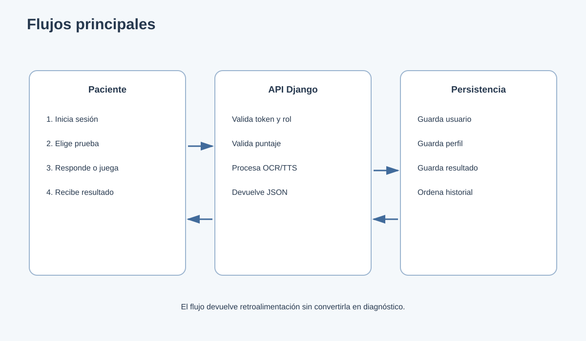
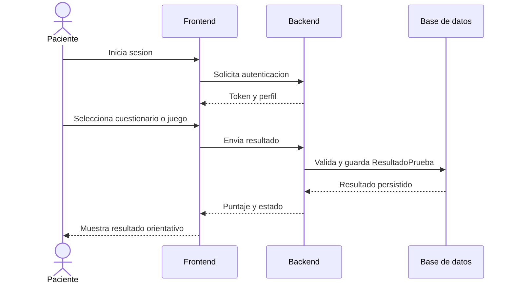
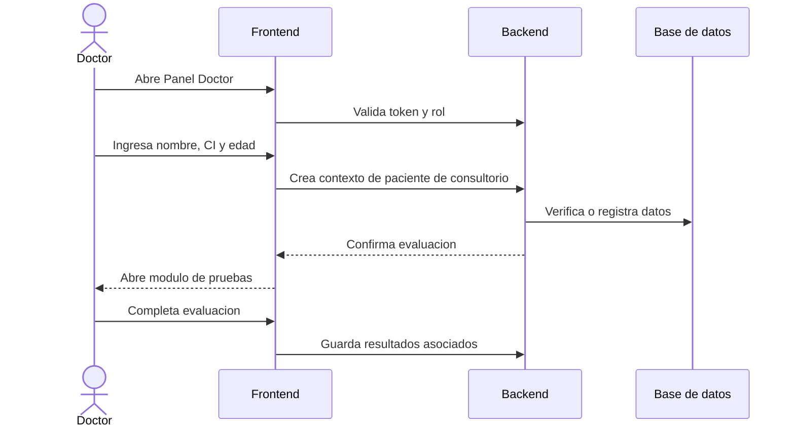
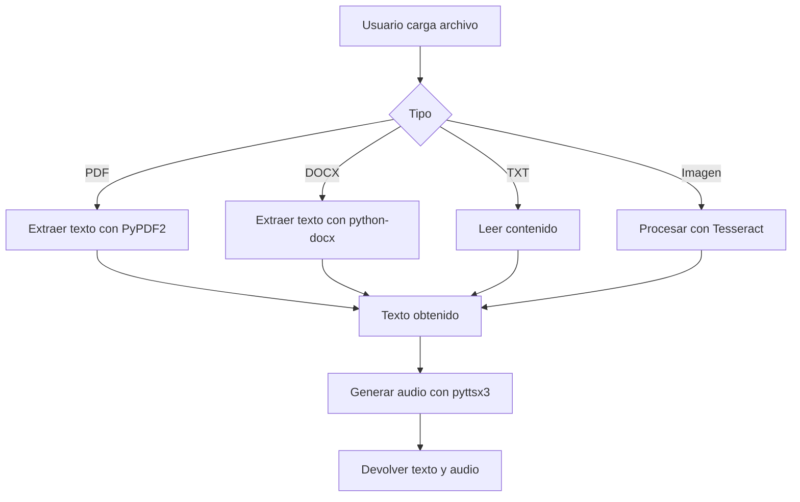

# 6. Flujos principales

## 6.1 Flujo de paciente

## 6.2 Flujo de doctor en consultorio

## 6.3 Flujo OCR y audio

## 6.4 Flujo de accesibilidad

1. El usuario abre `Personalizar vista`.
2. Selecciona fuente, tamano, interlineado o tema.
3. `AccessibilityContext` actualiza el estado global.
4. La interfaz aplica variables CSS al documento.
5. La configuracion se guarda en `localStorage`.
