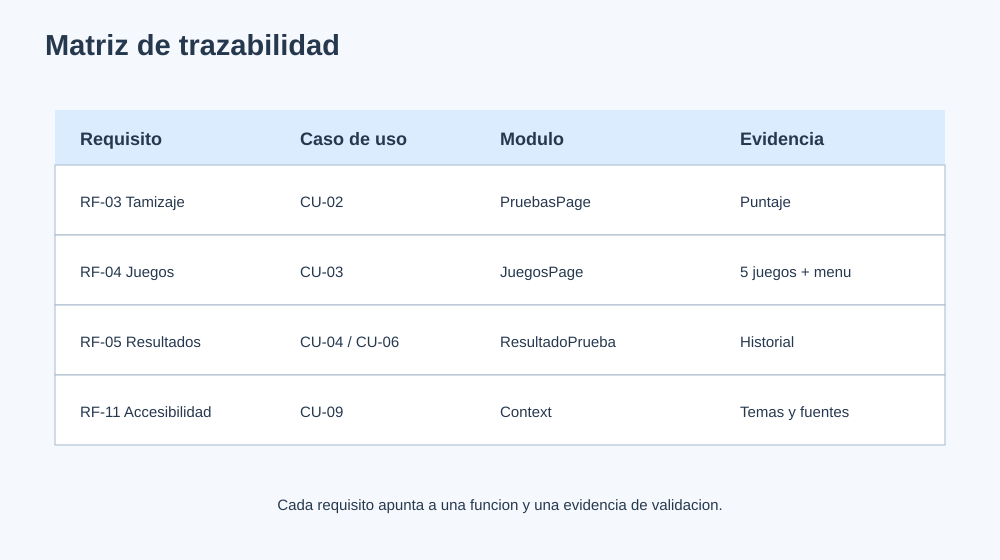

# 7. Matriz de trazabilidad

| Requisito | Caso de uso | Implementacion principal | Evidencia de validacion |
|---|---|---|---|
| RF-01 | CU-01 | `LoginPage`, `SignupPage` | Registro e inicio de sesion |
| RF-03 | CU-02 | `PruebasPage`, `CuestionarioRiesgoPage` | Rutas por lectura, velocidad, comprension y ortografia |
| RF-04 | CU-03 | `JuegosPage`, `JuegosInteractivosPage` | Cinco juegos y acceso al menú principal |
| RF-05 | CU-02/CU-03 | `TipoPrueba`, `ResultadoPrueba`, `RespuestaResultado`, endpoint de resultados | Puntaje, tipo catalogado y detalles persistibles |
| RF-06 | CU-05 | `DoctorDashboard`, endpoint consultorio | Inicio de evaluacion por edad y paciente |
| RF-07 | CU-06 | `DoctorPatientDetail`, `ResultadosPage` | Historial y detalle de puntajes |
| RF-08 | CU-07 | `AdminUsers` | Busqueda, filtros, paginacion y edicion |
| RF-09 | CU-08 | `lector/views.py`, `ArchivoProcesado` | PDF, DOCX, TXT, JPG, PNG, GIF y BMP |
| RF-10 | CU-08 | `pyttsx3`, `ConversionAudio`, `AudioPlayer`, Web Speech API | Lectura de texto y guia |
| RF-11 | CU-09 | `AccessibilityContext`, `TopNav` | Fuente, tamano, espaciado y temas |
| RF-12 | Todos | Aviso global en `TopNav` | Mensaje visible de alcance orientativo |

## Estado de cobertura

- **Implementado:** autenticacion, tamizaje, juegos principales, accesibilidad, OCR/TTS, roles y consulta de resultados.
- **Implementado recientemente:** vista Consejos, vista Senales y acceso de retorno al menú principal en la galería.
- **Pendiente recomendado:** ampliar pruebas automatizadas de componentes y flujos de autenticacion.
