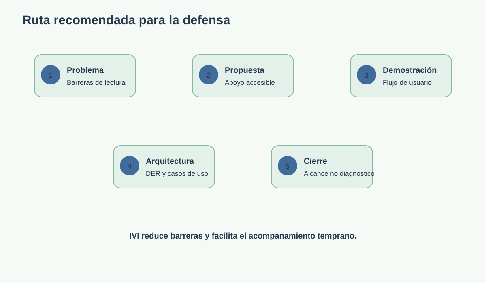

# 8. Guia para presentar el proyecto

## 8.1 Problema

Las personas con dislexia pueden enfrentar barreras en lectura, escritura, organizacion y acceso a contenidos. Muchas veces estas dificultades se confunden con falta de esfuerzo.

## 8.2 Propuesta

IVI ofrece un entorno accesible para orientar, explorar indicadores y acompanarlos mediante cuestionarios, juegos, lectores y seguimiento profesional.

## 8.3 Demostracion sugerida

1. Mostrar la pagina de inicio y el aviso de alcance no diagnostico.
2. Abrir `Consejos` y explicar el enfoque de acompanamiento.
3. Entrar a `Pruebas` y mostrar la separacion entre juegos y cuestionarios.
4. Abrir `Juegos de tamizaje` y mostrar las cinco actividades.
5. Mostrar las cinco actividades y regresar al menú principal mediante la tarjeta 06.
6. Mostrar un cuestionario por etapa.
7. Abrir `Personalizar vista` y cambiar fuente o tema.
8. Mostrar el lector de textos o documentos.
9. Explicar el flujo de doctor y resultados.
10. Cerrar con el DER y la arquitectura.

## 8.4 Mensaje de cierre

IVI no reemplaza al profesional: reduce barreras, organiza informacion y facilita una primera orientacion accesible para que el acompanamiento llegue antes y sea mas personalizado.

## 8.5 Preguntas frecuentes

### ¿IVI diagnostica dislexia?

No. Los resultados son orientativos y deben interpretarse junto con una evaluacion profesional.

### ¿Que diferencia hay entre un juego y un cuestionario?

Los juegos exploran habilidades mediante actividades breves; los cuestionarios recopilan indicadores organizados por etapa o tipo de dificultad.

### ¿Que aporta el doctor?

Puede iniciar evaluaciones en consultorio, consultar pacientes y revisar historiales de resultados.

### ¿Como se garantiza la accesibilidad?

La interfaz permite ajustar tipografia, tamano, interlineado y tema, e incorpora lectura de textos, OCR y controles con etiquetas accesibles.

## 8.6 Checklist previo a la defensa

- [ ] Backend iniciado y migraciones aplicadas.
- [ ] Frontend iniciado en el puerto 3000.
- [ ] Tesseract instalado si se demostrara OCR.
- [ ] Usuario paciente de prueba creado.
- [ ] Usuario doctor de prueba creado.
- [ ] Datos de ejemplo disponibles para mostrar resultados.
- [ ] Navegador con audio habilitado.
- [ ] Presentacion revisada con la advertencia de no diagnostico.
