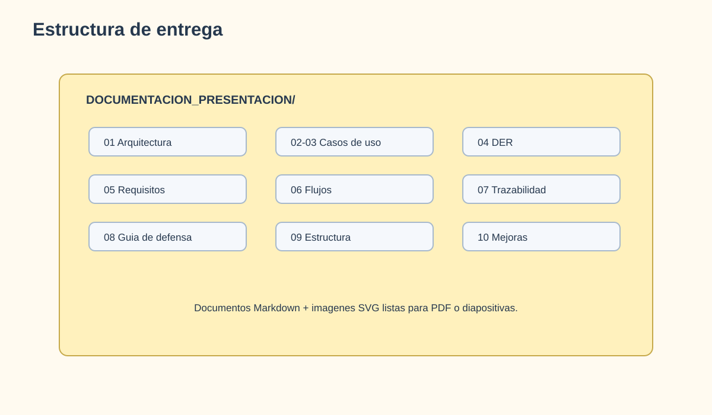

# 9. Estructura sugerida de entrega



```text
IVI/
├── backend/                         # API Django, modelos y procesamiento
├── frontend/                        # Aplicacion React y experiencia accesible
├── DOCUMENTACION_PRESENTACION/      # Paquete formal para presentar
│   ├── README.md
│   ├── 01_ARQUITECTURA.md
│   ├── 02_CASOS_DE_USO_NIVEL_0.md
│   ├── 03_CASOS_DE_USO_NIVEL_1.md
│   ├── 04_DER_MODELO_DATOS.md
│   ├── 05_REQUISITOS.md
│   ├── 06_FLUJOS_PRINCIPALES.md
│   ├── 07_MATRIZ_TRAZABILIDAD.md
│   ├── 08_GUIA_DE_PRESENTACION.md
│   ├── 09_ESTRUCTURA_ENTREGA.md
│   ├── 10_LIMITACIONES_Y_MEJORAS.md
│   ├── 11_PLAN_DE_PRUEBAS.md
│   ├── 12_API.md
│   ├── 13_SEGURIDAD_PRIVACIDAD.md
│   ├── 14_DICCIONARIO_DATOS.md
│   ├── 15_MANUAL_USUARIO.md
│   ├── 16_DESPLIEGUE.md
│   ├── 17_ALCANCE_RIESGOS_CONCLUSIONES.md
│   └── 18_CATALOGO_DE_CASOS_DE_USO.md
├── README.md
└── ...
```

## Material que puede exportarse a PDF

- Documento completo: unir los archivos del 01 al 17.
- Diapositivas: usar las secciones Problema, Propuesta, Arquitectura, Nivel 0, Nivel 1, DER, Demo y Conclusiones.
- Defensa tecnica: mostrar los diagramas Mermaid renderizados y las rutas reales del sistema.
