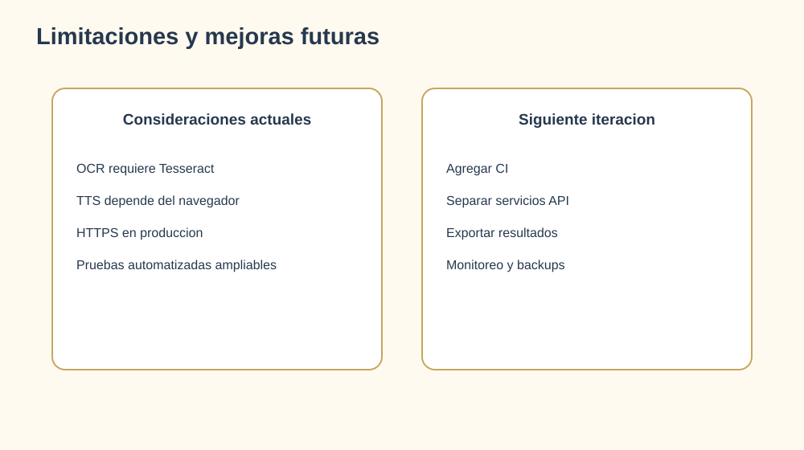

# 10. Limitaciones y mejoras futuras

## Limitaciones actuales

- La lectura con Web Speech API depende de las voces disponibles en el navegador.
- El OCR requiere que Tesseract este instalado y correctamente configurado.
- El despliegue productivo requiere configurar HTTPS, CORS, secretos y una base de datos de produccion.
- La cobertura de pruebas automatizadas puede ampliarse.

## Mejoras priorizadas

1. Crear pruebas de componentes para tarjetas, filtros y juegos.
2. Añadir pruebas de integracion para autenticacion y roles.
3. Separar servicios API del codigo de las paginas frontend.
4. Configurar CI para build, lint y pruebas.
5. Incorporar exportacion de resultados para profesionales.
6. Añadir telemetria anonima solo con consentimiento.
