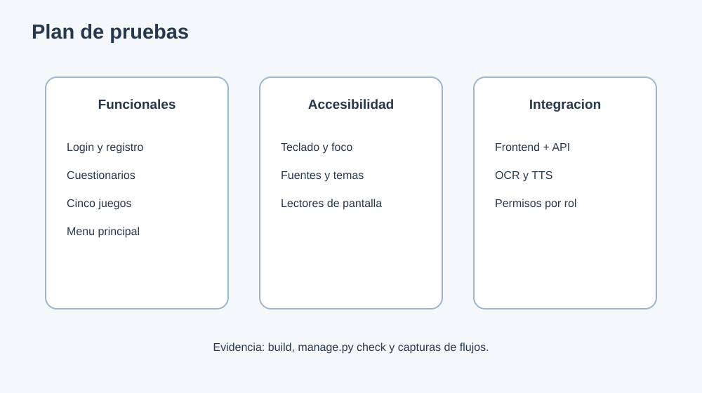

# 11. Plan de pruebas

## Objetivo

Verificar que IVI cumple sus funciones principales, protege los accesos por rol y mantiene una experiencia accesible.

## Pruebas funcionales

| ID | Escenario | Resultado esperado |
|---|---|---|
| PF-01 | Registrar paciente con datos validos | Cuenta creada y token devuelto |
| PF-02 | Registrar paciente sin CI | Mensaje de validacion y no se crea cuenta |
| PF-03 | Iniciar sesion con credenciales validas | Se obtiene perfil y se redirige |
| PF-04 | Iniciar sesion con password incorrecta | Respuesta 401 |
| PF-05 | Completar cuestionario | Se calcula puntaje y se muestra resultado |
| PF-06 | Completar cada juego | Se muestra avance y resultado |
| PF-07 | Seleccionar tarjeta 06 | El menú principal se abre correctamente |
| PF-08 | Consultar historial | Se muestran resultados ordenados por fecha |
| PF-09 | Doctor inicia prueba en consultorio | Paciente provisional asociado a la evaluacion |
| PF-10 | Doctor consulta paciente | Se muestran resultados permitidos |
| PF-11 | Paciente intenta API de doctor | Respuesta 403 |
| PF-12 | Admin crea, filtra y edita usuario | Operaciones completadas con validacion |
| PF-13 | Procesar PDF, DOCX, TXT e imagen | Texto extraido o error explicado |
| PF-14 | Activar lectura de guia | El navegador inicia y detiene TTS |
| PF-15 | Crear resultado con tipo de prueba del catalogo | Resultado asociado a `TipoPrueba` |
| PF-16 | Registrar respuesta detallada | No se repite la clave dentro del resultado |
| PF-17 | Procesar archivo autenticado | Se crean `ArchivoProcesado` y `ConversionAudio` |

## Pruebas de accesibilidad

- Navegacion completa con teclado.
- Foco visible en enlaces, botones y controles.
- Lectura correcta con lector de pantalla.
- Cambio entre Lexend, Atkinson y OpenDyslexic.
- Verificacion con temas claro, crema, sepia y oscuro.
- Texto legible con aumento de tamano e interlineado.
- Reflujo correcto en viewport movil.

## Pruebas de integracion

1. Frontend inicia y carga las rutas principales.
2. Backend responde `/api/status/`.
3. Login entrega token utilizable.
4. La tarjeta 06 navega al menú principal.
5. Doctor puede consultar el resultado del paciente.
6. OCR responde cuando Tesseract esta disponible.
7. `python manage.py migrate` deja aplicadas las migraciones de `usuarios` y `archivos`.

## Evidencia

- `npm run build` debe terminar con codigo 0.
- `python manage.py check` no debe reportar errores.
- Capturas de cada flujo deben guardarse en la carpeta de evidencias de la defensa.
