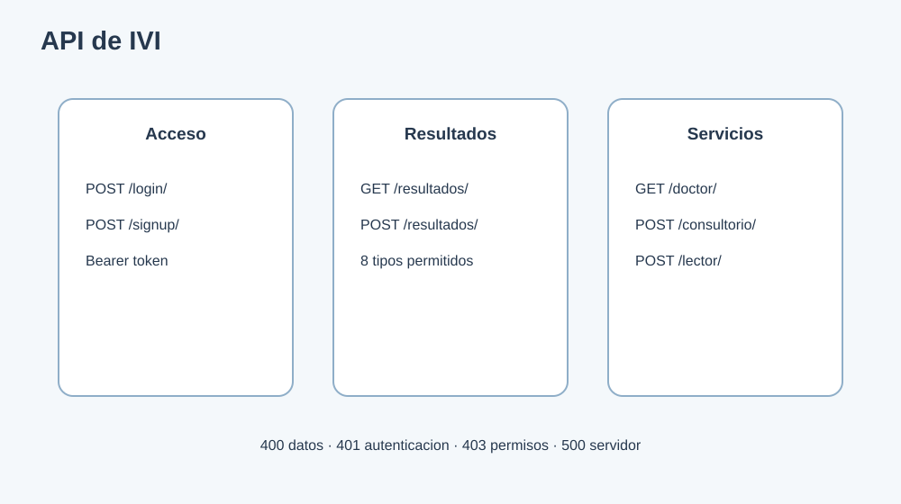

# 12. Contrato resumido de API



Base local: `http://127.0.0.1:8000/api/`

## Autenticacion

### `POST /api/login/`

```json
{"email":"usuario@email.com","password":"secreto"}
```

Devuelve token y perfil. Las peticiones protegidas usan:

```http
Authorization: Bearer token_xxx
```

### `POST /api/signup/`

Crea un paciente o profesional segun los datos enviados. Valida username, email, CI, edad, matricula y especialidad.

## Resultados

### `GET /api/resultados/`

Devuelve los resultados del usuario autenticado.

### `POST /api/resultados/`

```json
{
  "tipo_prueba":"parejas",
  "puntaje":100,
  "duracion_segundos":42,
  "detalles":{"aciertos":3,"rondas":3,"nivel":0}
}
```

Tipos permitidos: `lectura`, `velocidad`, `comprension`, `ortografia`, `alfabeto`, `parejas`, `silabas`, `letras`.

El servidor resuelve `tipo_prueba` contra la tabla `TipoPrueba` y conserva los
detalles variables en `ResultadoPrueba.detalles`. Las respuestas estructuradas
pueden asociarse como registros de `RespuestaResultado`.

## Doctor

- `GET /api/doctor/`: consulta previa o resultados de pacientes.
- `GET /api/doctor/?ci=123`: filtra por CI.
- `GET /api/doctor/?name=ana`: busca por nombre o usuario.
- `GET /api/doctor/?tipo_prueba=parejas`: filtra por tipo.
- `POST /api/doctor/consultorio/`: crea o recupera paciente provisional.

Requiere rol `doctor` o `admin`.

## Administracion

- `GET /api/admin/users/`: lista con filtros y paginacion.
- `POST /api/admin/users/`: crea usuario.
- `PUT /api/admin/users/<id>/`: edita usuario.
- `DELETE /api/admin/users/<id>/`: elimina usuario.
- `GET /api/admin/results/`: consulta resultados administrativos.
- `GET /api/admin/lector/`: consulta estado del lector.

Requiere rol `admin`.

## Lector y OCR

- `GET /api/lector/check-tesseract/`: informa si Tesseract esta disponible.
- `POST /api/lector/extract-and-speak/`: recibe texto JSON o archivo PDF, DOCX, TXT, JPG, PNG, GIF o BMP.
- `POST /api/archivos/procesar/`: procesa PDF, DOCX o TXT y genera audio; guarda `ArchivoProcesado` y `ConversionAudio`.
- `POST /api/archivos/describe-ia/`: describe una imagen mediante OCR o BLIP cuando las dependencias estan instaladas.

La respuesta del lector contiene texto extraido y audio codificado para el frontend.

## Respuestas de error

- `400`: datos invalidos o archivo no soportado.
- `401`: token ausente o invalido.
- `403`: rol insuficiente.
- `404`: recurso inexistente.
- `500`: error interno no controlado.
