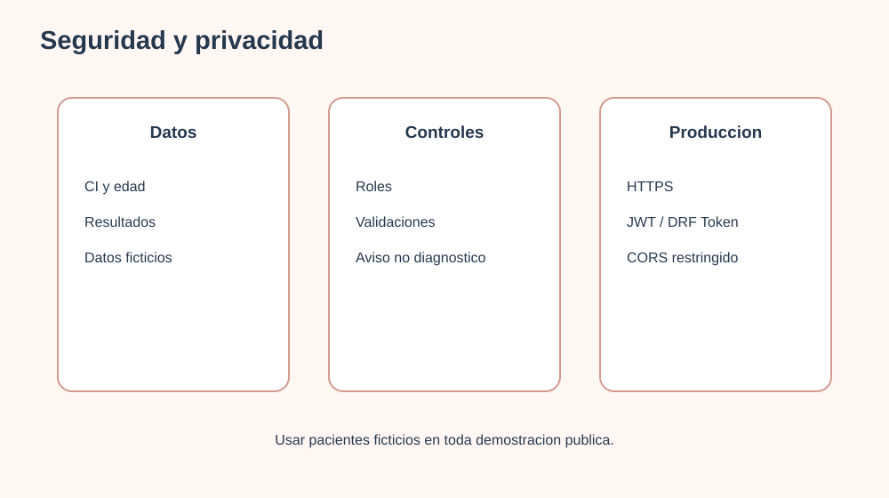

# 13. Seguridad y privacidad

## Datos tratados

IVI puede tratar nombre, usuario, email, CI, edad, datos profesionales, archivos procesados, texto extraido, audio y resultados de tamizaje. Estos datos deben considerarse sensibles y utilizarse solo para el objetivo informado.

## Controles actuales

- Validacion de roles para doctor y administrador.
- Autorizacion mediante header Bearer.
- Validacion de CI, edad, puntaje y tipos de prueba.
- Separacion de resultados por usuario.
- Separacion de datos de paciente y profesional en tablas especificas.
- Proteccion de resultados ante borrado accidental del tipo de prueba.
- Eliminacion en cascada de respuestas al eliminar un resultado y de conversiones al eliminar un archivo.
- Mensaje explicito de que el resultado no es diagnostico.
- Restriccion de acceso a detalles de pacientes.

## Riesgos actuales

El proyecto utiliza tokens simples construidos en el backend (`token_id_username`). Para produccion deben reemplazarse por JWT o tokens de DRF con expiracion y revocacion.

## Recomendaciones para produccion

- Usar HTTPS obligatorio.
- Mover secretos a variables de entorno.
- Aplicar hash de contrasenas con el sistema de Django.
- Usar JWT/DRF Token con expiracion.
- Configurar CORS solo para dominios conocidos.
- Agregar limitacion de peticiones y proteccion contra fuerza bruta.
- Validar tamano y contenido real de archivos subidos.
- Limitar la retencion de `ArchivoProcesado`, texto extraido y conversiones de audio.
- Almacenar archivos temporales fuera de rutas publicas.
- Registrar auditoria de accesos de profesionales.
- Definir politica de retencion y eliminacion de resultados.
- Solicitar consentimiento informado cuando corresponda.
- Evitar mostrar CI completo en capturas o demostraciones.

## Privacidad en la defensa

Para la presentacion se deben usar cuentas y pacientes ficticios. No deben mostrarse nombres, CI, correos ni resultados reales.
