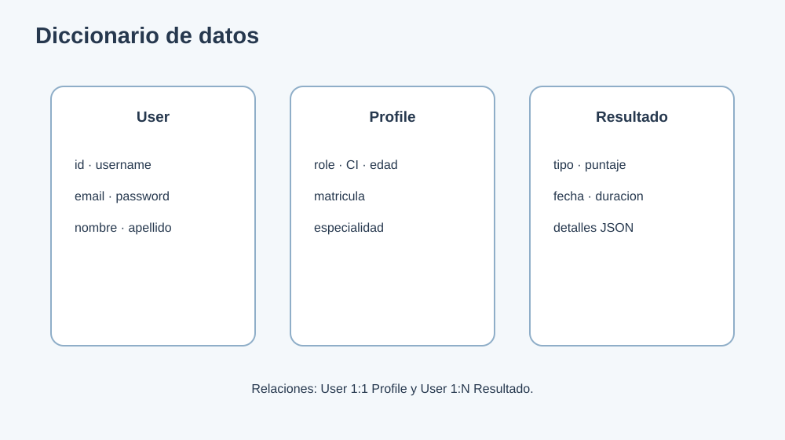

# 14. Diccionario de datos

## User

| Campo | Tipo | Obligatorio | Descripcion |
|---|---|---|---|
| id | Entero | Si | Identificador interno |
| username | Texto | Si | Nombre unico de acceso |
| email | Texto | Si | Correo del usuario |
| password | Hash | Si | Contrasena almacenada por Django |
| first_name | Texto | No | Nombre |
| last_name | Texto | No | Apellido |

## Profile

| Campo | Tipo | Obligatorio | Descripcion |
|---|---|---|---|
| user_id | FK unica | Si | Relacion 1:1 con User |
| role | Enum | Si | admin, doctor o paciente |
| ci | Texto unico | Paciente | Identificador civil |
| age | Entero | Paciente | Edad entre 1 y 120 |
| license_number | Texto | Doctor | Matricula profesional |
| specialty | Texto | Doctor | Especialidad |
| institution | Texto | No | Institucion asociada |
| is_office_patient | Booleano | No | Marca paciente de consultorio |

## ResultadoPrueba

| Campo | Tipo | Obligatorio | Descripcion |
|---|---|---|---|
| usuario_id | FK | Si | Usuario propietario |
| tipo_prueba | Enum | Si | Tipo de cuestionario o juego |
| puntaje | Entero | Si | Valor entre 0 y 100 |
| fecha_prueba | Fecha/hora | Si | Creacion automatica |
| duracion_segundos | Entero | No | Duracion de la actividad |
| detalles | JSON | No | Respuestas, aciertos y nivel |
| estado | Enum | Si | completada, incompleta o cancelada |

## Tipos de prueba

`lectura`, `velocidad`, `comprension`, `ortografia`, `alfabeto`, `parejas`, `silabas` y `letras`.
