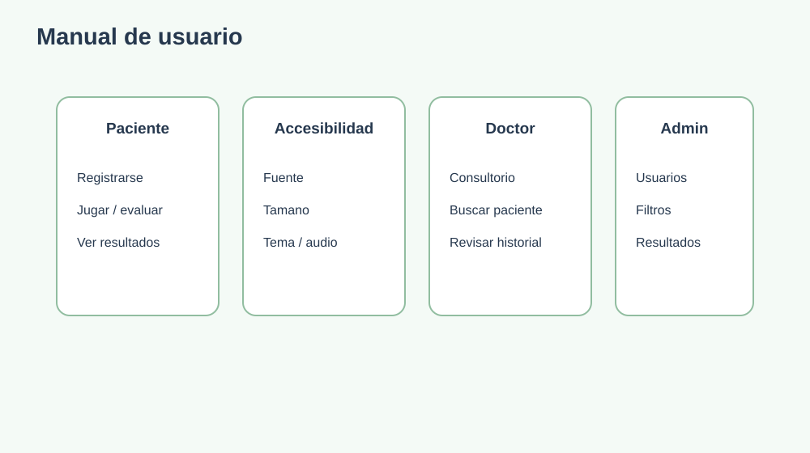

# 15. Manual de usuario

## Paciente o visitante

1. Abrir la plataforma.
2. Consultar Acerca de, Senales o Consejos.
3. Registrarse con username, email, CI y edad.
4. Iniciar sesion.
5. Abrir Pruebas o Juegos.
6. Elegir etapa, edad o dificultad.
7. Completar la actividad sin presion de tiempo.
8. Revisar el resultado orientativo.
9. Consultar el historial desde Resultados.

## Personalizar la vista

Desde `Personalizar vista` se puede cambiar fuente, tamano, interlineado y tema. La configuracion se guarda en el navegador.

## Lectura accesible

1. Abrir `Ivi te ayuda`.
2. Elegir Lector de Documentos o Lector de Textos.
3. Cargar un archivo o escribir texto.
4. Esperar la extraccion.
5. Reproducir el audio.

## Doctor o profesional

1. Iniciar sesion con rol profesional.
2. Abrir el Panel Doctor.
3. Elegir iniciar pruebas.
4. Seleccionar evaluacion propia o paciente en consultorio.
5. Para seguimiento, buscar por nombre o CI.
6. Aplicar filtros por tipo y fechas.
7. Abrir el detalle de resultados.

## Administrador

1. Iniciar sesion con rol admin.
2. Abrir Gestion de Usuarios.
3. Buscar o filtrar registros.
4. Crear, editar o eliminar usuarios.
5. Revisar resultados administrativos.

## Interpretacion

Los resultados son orientativos. No deben utilizarse para etiquetar ni diagnosticar sin evaluacion profesional.
