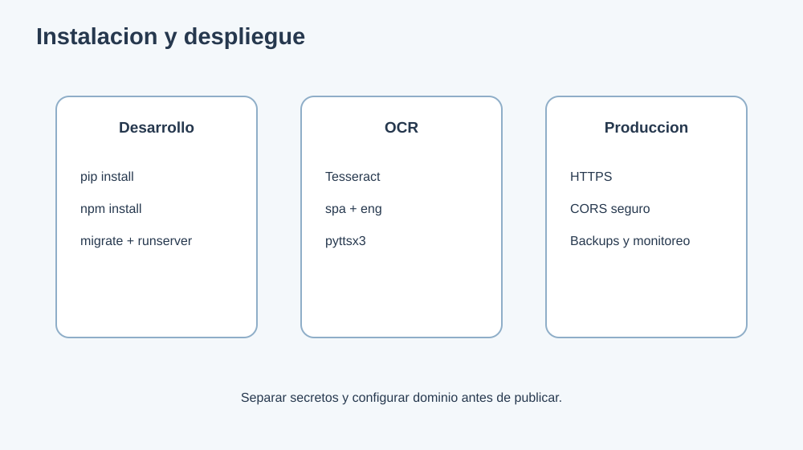

# 16. Instalacion y despliegue



## Desarrollo local

### Backend

```powershell
cd backend
python -m pip install -r requirements.txt
python manage.py migrate
python manage.py check
python manage.py runserver 127.0.0.1:8000
```

### Frontend

```powershell
cd frontend
npm install
npm start
```

Frontend: `http://localhost:3000`  
Backend: `http://localhost:8000`

## Requisito OCR

Instalar Tesseract OCR y verificar:

```powershell
tesseract --version
tesseract --list-langs
```

Debe estar disponible el idioma `spa` para procesar texto en español.

## Produccion

La forma recomendada es un VPS o servicio PaaS con almacenamiento persistente. El
dominio no cambia al reiniciar la aplicación: el dominio apunta siempre al mismo
servidor mediante DNS y el proceso de Django se reinicia con un supervisor
(`systemd`, Docker o el supervisor del PaaS).

1. Crear el servidor y apuntar el registro DNS `A` del dominio a su IP fija.
2. Crear un entorno virtual Python e instalar `backend/requirements.txt`.
3. Configurar las variables de `backend/.env.example` en el proveedor (no subir `.env`).
4. Usar PostgreSQL en producción mediante `DATABASE_URL`. SQLite solo es apropiado
   para desarrollo o un VPS con disco persistente y un único proceso.
5. Ejecutar `python manage.py migrate` y `python manage.py collectstatic --noinput`.
6. Construir el frontend con `REACT_APP_API_URL=/api` y `npm run build`.
7. Servir `frontend/build` y hacer proxy de `/api/` y `/admin/` hacia Gunicorn.
8. Ejecutar Django con `gunicorn backend.wsgi:application` bajo un supervisor.
9. Activar HTTPS (por ejemplo, Let's Encrypt) y conservar el mismo dominio en
   `DJANGO_ALLOWED_HOSTS`, `CORS_ALLOWED_ORIGINS` y `CSRF_TRUSTED_ORIGINS`.
10. Configurar copias de seguridad de PostgreSQL y del directorio `media/`.

Ejemplo de arranque de Django en Linux:

```bash
cd backend
gunicorn --bind 127.0.0.1:8000 --workers 3 backend.wsgi:application
```

El frontend debe compilarse con la URL pública de la API:

```bash
cd frontend
REACT_APP_API_URL=/api npm run build
```

En Windows, use Waitress o un servicio equivalente en lugar de Gunicorn.

### Despliegue gratuito con Hugging Face, GitHub Pages y Neon

La configuración gratuita separa la aplicación en tres servicios:

- **Hugging Face Docker Space**: ejecuta Django, Tesseract y Gunicorn en
  `https://<usuario>-<space>.hf.space`.
- **Neon**: conserva los datos en PostgreSQL mediante `DATABASE_URL`.
- **GitHub Pages**: publica React en
  `https://nestorzalazar.github.io/IVI/`.

La URL de GitHub Pages no cambia cuando el backend se reinicia. El plan gratuito
del Space puede pausar el contenedor después de inactividad, por lo que la primera
petición posterior puede tardar. Los archivos escritos dentro del contenedor son
efímeros; la base de datos debe permanecer en Neon y los archivos subidos
requieren un almacenamiento externo si deben sobrevivir a reinicios.

#### Backend Django

1. Crear un Docker Space nuevo en Hugging Face.
2. Subir el contenido de `backend/` del repositorio, incluyendo su
   `Dockerfile`, `entrypoint.sh` y `README.md`.
3. En **Settings > Variables and secrets**, configurar `DATABASE_URL` usando la
   cadena pooled de Neon para las consultas de la aplicación.
4. Configurar `DJANGO_SECRET_KEY` con un secreto nuevo y no reutilizado.
5. Reemplazar `<usuario>` y `<space>` en `DJANGO_ALLOWED_HOSTS`.
6. Configurar `CORS_ALLOWED_ORIGINS` y `CSRF_TRUSTED_ORIGINS` con
   `https://nestorzalazar.github.io`.

#### Frontend React

El archivo `.github/workflows/deploy-pages.yml` compila y publica el frontend.

1. En GitHub activar **Settings > Pages > Source: GitHub Actions**.
2. Crear una variable de repositorio llamada `BACKEND_API_URL` con el valor
   `https://<usuario>-<space>.hf.space/api`.
3. Hacer push a `main` o ejecutar el workflow manualmente.
4. Probar primero `https://<usuario>-<space>.hf.space/api/status/` y después
   `https://nestorzalazar.github.io/IVI/`.

Para conservar los datos actuales de SQLite antes de migrar:

```powershell
cd backend
python manage.py dumpdata --natural-foreign --natural-primary -e contenttypes -e auth.Permission --indent 2 > data.json
```

Después de configurar `DATABASE_URL` en el Space, cargar el archivo desde una tarea
segura o consola administrativa:

```bash
python manage.py loaddata data.json
```

No subir `data.json` al repositorio si contiene usuarios o información personal.

## Checklist de despliegue

- [ ] Secretos fuera del repositorio.
- [ ] HTTPS activo.
- [ ] CORS restringido.
- [ ] Tesseract instalado en el servidor.
- [ ] Migraciones aplicadas.
- [ ] Verificar que el catalogo de `TipoPrueba` contenga los ocho tipos iniciales.
- [ ] Revisar permisos y politica de retencion para archivos procesados y audio.
- [ ] Usuario administrador creado.
- [ ] Prueba de login ejecutada.
- [ ] Prueba de OCR ejecutada.
- [ ] Copia de seguridad verificada.
