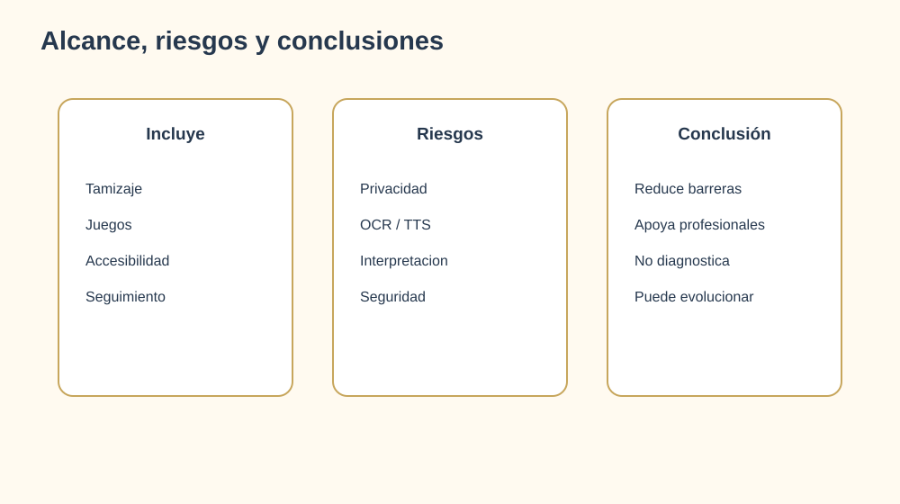

# 17. Alcance, riesgos y conclusiones

## Alcance incluido

- Plataforma web React y API Django.
- Registro, autenticacion y roles.
- Cuestionarios por etapa.
- Cinco juegos de tamizaje y un acceso al menú principal.
- Historial y seguimiento profesional.
- Lectura de documentos, OCR y audio.
- Configuracion de accesibilidad.
- Administracion de usuarios.
- Modelo de datos normalizado para perfiles, pruebas, respuestas y archivos procesados.

## Fuera de alcance

- Diagnostico clinico automatico.
- Sustitucion de psicopedagogos, neurologos o fonoaudiologos.
- Interpretacion medica definitiva.
- Integracion con historias clinicas externas.
- Despliegue productivo institucional sin configuracion adicional.

## Riesgos y mitigaciones

| Riesgo | Impacto | Mitigacion |
|---|---|---|
| Resultado interpretado como diagnostico | Alto | Avisos, guia y derivacion profesional |
| Exposicion de datos personales | Alto | Roles, HTTPS, minimizacion y auditoria |
| OCR impreciso | Medio | Mensaje de revision y mejora de imagen |
| TTS no disponible | Medio | Web Speech API y mensaje de fallback |
| Token simple en desarrollo | Alto | Migrar a JWT/DRF Token en produccion |
| Falta de cobertura automatizada | Medio | Plan de pruebas y CI |
| Retencion innecesaria de archivos o audio | Medio | Politica de expiracion, acceso restringido y borrado controlado |

## Conclusiones

IVI integra tamizaje orientativo, actividades ludicas, lectura accesible y seguimiento profesional en una sola plataforma. Su valor principal es reducir barreras de acceso y presentar la informacion en formatos adaptables.

El sistema queda preparado para una demostracion funcional con un modelo de datos normalizado: los perfiles no duplican datos especificos, las pruebas usan un catalogo, las respuestas pueden crecer sin sobrecargar el resultado y el lector conserva su trazabilidad. La siguiente evolucion debe priorizar seguridad, retencion de archivos, pruebas automatizadas y despliegue institucional.
