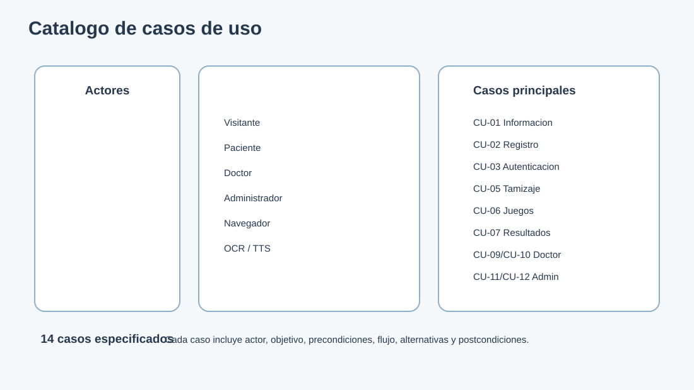
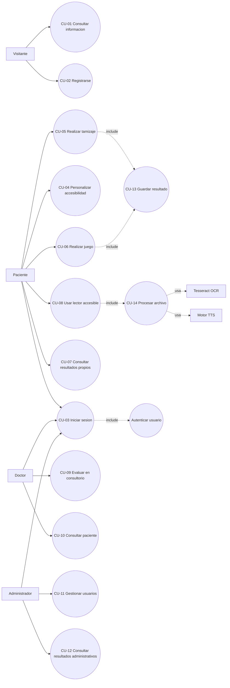

# 18. Catalogo completo de casos de uso

## 18.1 Actores del sistema

| Actor | Tipo | Responsabilidad |
|---|---|---|
| Visitante | Primario | Consulta informacion publica y puede registrarse. |
| Paciente | Primario | Realiza tamizajes, juegos, lectura y consulta sus resultados. |
| Doctor/profesional | Primario | Inicia evaluaciones, consulta pacientes y revisa resultados. |
| Administrador | Primario | Gestiona usuarios y supervisa resultados administrativos. |
| Navegador | Secundario | Ejecuta React, almacenamiento local y lectura Web Speech. |
| Tesseract OCR | Secundario | Extrae texto de imagenes. |
| Motor TTS | Secundario | Convierte texto en audio desde el backend. |

## 18.2 Relaciones entre casos de uso

## 18.3 Especificaciones detalladas

### CU-01 Consultar informacion

- **Actor principal:** Visitante.
- **Objetivo:** conocer la dislexia, sus señales, estrategias y alcance de IVI.
- **Precondiciones:** ninguna.
- **Disparador:** el visitante abre Inicio, Acerca de, Senales o Consejos.
- **Flujo principal:** navegar por la informacion, seleccionar una seccion y leer el contenido.
- **Alternativas:** si se solicita lectura asistida, usar el control de audio del navegador.
- **Postcondicion:** el visitante recibe informacion orientativa.

### CU-02 Registrarse

- **Actor principal:** Visitante.
- **Objetivo:** crear una cuenta de paciente.
- **Precondiciones:** username y email no registrados.
- **Flujo principal:** completar formulario, enviar datos, validar username, email, CI y edad, crear User/Profile y devolver token.
- **Alternativas:** datos incompletos, CI no numerico, CI duplicado, email duplicado o edad invalida.
- **Postcondicion:** cuenta creada y sesion iniciada.

### CU-03 Iniciar sesion

- **Actor principal:** Paciente, doctor o administrador.
- **Objetivo:** acceder a funciones protegidas.
- **Precondiciones:** cuenta existente y activa.
- **Flujo principal:** ingresar email/username y contrasena, autenticar, cargar perfil y redirigir segun el flujo.
- **Alternativas:** credenciales incorrectas o token ausente.
- **Postcondicion:** sesion identificada por token.

### CU-04 Personalizar accesibilidad

- **Actor principal:** cualquier usuario.
- **Objetivo:** adaptar la interfaz a sus necesidades de lectura.
- **Precondiciones:** aplicacion cargada.
- **Flujo principal:** elegir fuente, tamano, interlineado y tema; aplicar cambios y guardarlos localmente.
- **Alternativas:** valor fuera de rango; conservar el valor anterior.
- **Postcondicion:** las vistas aplican la configuracion seleccionada.

### CU-05 Realizar tamizaje

- **Actor principal:** Paciente o doctor en modo consultorio.
- **Objetivo:** obtener indicadores orientativos relacionados con lectura, velocidad, comprension u ortografia.
- **Precondiciones:** acceso al modulo y edad disponible cuando corresponde.
- **Flujo principal:** elegir etapa, responder preguntas, enviar respuestas, calcular puntaje y mostrar advertencia no diagnostica.
- **Alternativas:** abandonar, responder parcialmente o reiniciar.
- **Postcondicion:** resultado disponible y guardado mediante CU-13.

### CU-06 Realizar juego

- **Actor principal:** Paciente o doctor en modo consultorio.
- **Objetivo:** explorar habilidades mediante actividades ludicas.
- **Precondiciones:** acceso a la galeria.
- **Flujo principal:** elegir edad/dificultad, abrir un juego, seleccionar nivel, completar la actividad y ver el resultado.
- **Juegos actuales:** Parejas escondidas, Tren de silabas, Lluvia de letras, Velocidad de lectura y Reto de ortografia.
- **Alternativas:** reiniciar nivel, cambiar dificultad o volver al catalogo.
- **Postcondicion:** desempeno mostrado y guardado cuando la actividad lo implementa.

### CU-07 Consultar resultados propios

- **Actor principal:** Paciente.
- **Objetivo:** revisar historial de pruebas y juegos.
- **Precondiciones:** sesion iniciada.
- **Flujo principal:** abrir Resultados, solicitar historial y revisar tipo, puntaje, fecha, duracion y detalles.
- **Alternativas:** no existen resultados; mostrar estado vacio.
- **Postcondicion:** el paciente visualiza su propio historial.

### CU-08 Usar lector accesible

- **Actor principal:** Paciente o visitante.
- **Objetivo:** convertir documentos o textos a un formato mas accesible.
- **Precondiciones:** navegador compatible y archivo permitido.
- **Flujo principal:** abrir lector, cargar PDF/DOCX/TXT o escribir texto, procesar contenido y reproducir audio.
- **Alternativas:** formato no soportado, archivo vacio o TTS no disponible.
- **Postcondicion:** texto mostrado y audio disponible cuando el servicio funciona.

### CU-09 Evaluar en consultorio

- **Actor principal:** Doctor/profesional.
- **Objetivo:** iniciar una prueba para una persona atendida presencialmente.
- **Precondiciones:** doctor autenticado.
- **Flujo principal:** ingresar nombre, CI y edad, crear o recuperar perfil provisional y abrir `/pruebas`.
- **Alternativas:** CI no numerico, edad fuera de rango o datos incompletos.
- **Postcondicion:** evaluacion asociada al paciente de consultorio.

### CU-10 Consultar paciente

- **Actor principal:** Doctor/profesional.
- **Objetivo:** revisar resultados de pacientes.
- **Precondiciones:** rol doctor o admin y token valido.
- **Flujo principal:** buscar por nombre o CI, filtrar por tipo/fechas, agrupar resultados y abrir detalle.
- **Alternativas:** paciente inexistente, sin resultados o rol insuficiente.
- **Postcondicion:** historial consultado sin exponer pacientes a otros roles.

### CU-11 Gestionar usuarios

- **Actor principal:** Administrador.
- **Objetivo:** mantener usuarios y perfiles.
- **Precondiciones:** rol admin.
- **Flujo principal:** listar, buscar, filtrar, crear, editar o eliminar usuarios.
- **Alternativas:** duplicados, campos invalidos o cancelacion de eliminacion.
- **Postcondicion:** usuarios actualizados y cambios confirmados.

### CU-12 Consultar resultados administrativos

- **Actor principal:** Administrador.
- **Objetivo:** revisar informacion agregada o administrativa.
- **Precondiciones:** rol admin.
- **Flujo principal:** abrir resultados administrativos, solicitar datos y aplicar filtros.
- **Alternativas:** respuesta vacia o error de conexion.
- **Postcondicion:** informacion administrativa disponible para supervision.

### CU-13 Guardar resultado

- **Actor principal:** sistema.
- **Actores relacionados:** paciente, doctor o administrador.
- **Objetivo:** persistir puntaje y detalles de una actividad.
- **Precondiciones:** tipo permitido, puntaje entre 0 y 100 y usuario valido.
- **Flujo principal:** validar token, validar rol si hay paciente destino, validar tipo/puntaje, crear `ResultadoPrueba`.
- **Alternativas:** token invalido, tipo no permitido, puntaje fuera de rango o paciente inexistente.
- **Postcondicion:** resultado almacenado con fecha, estado y detalles JSON.

### CU-14 Procesar archivo

- **Actor principal:** sistema.
- **Actores secundarios:** Tesseract OCR y motor TTS.
- **Objetivo:** extraer texto y generar audio.
- **Precondiciones:** archivo permitido y dependencias instaladas.
- **Flujo principal:** detectar extension, extraer texto, generar audio, devolver respuesta al frontend.
- **Alternativas:** Tesseract ausente, archivo invalido, texto vacio o error TTS.
- **Postcondicion:** texto y audio disponibles o error explicado.

## 18.4 Matriz actor-caso de uso

| Actor | Casos de uso |
|---|---|
| Visitante | CU-01, CU-02, CU-04, CU-08 |
| Paciente | CU-03, CU-04, CU-05, CU-06, CU-07, CU-08 |
| Doctor | CU-03, CU-04, CU-05, CU-06, CU-09, CU-10 |
| Administrador | CU-03, CU-10, CU-11, CU-12 |
| Sistema | CU-13, CU-14 |
| Tesseract/TTS | CU-14 |

## 18.5 Reglas generales

- Un resultado orientativo no equivale a un diagnostico.
- Doctor y administrador pueden operar sobre pacientes segun sus permisos.
- El paciente solo debe consultar sus propios resultados.
- Los datos personales usados en la presentacion deben ser ficticios.
