# Diagramas de tesis de IVI

Este documento contiene las 14 fuentes Mermaid correspondientes al Plan Tecnico. Cada bloque puede renderizarse desde Markdown compatible con Mermaid o exportarse como SVG/PNG para incorporarlo a la tesis.

## Figura 6.1. Diagrama de contexto. Nivel 0

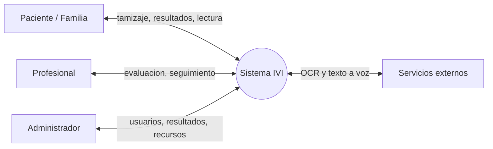

## Figura 6.2. Diagrama de flujo de datos. Nivel 1

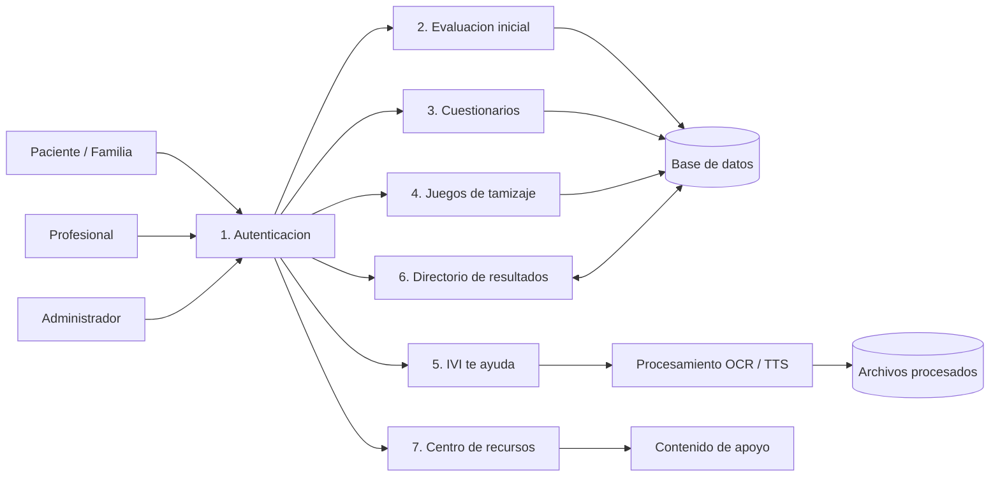

## Figura 6.3. Diagrama conceptual

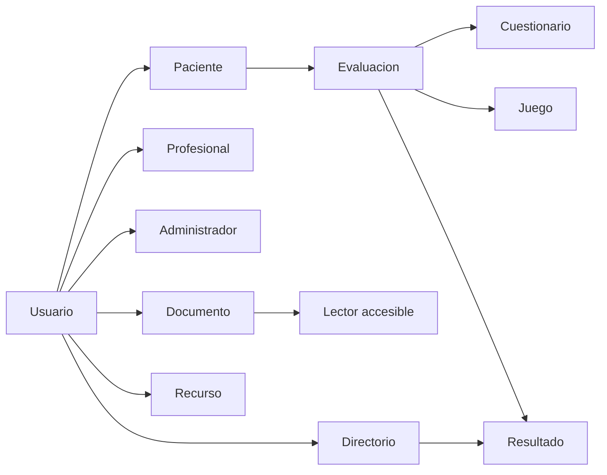

> Este diagrama representa conceptos del negocio. Evaluacion, Cuestionario, Juego, Documento, Recurso y Directorio no deben presentarse como tablas independientes si no existen como modelos persistentes.

## Figura 6.4. Diagrama de casos de uso - Paciente/Familia

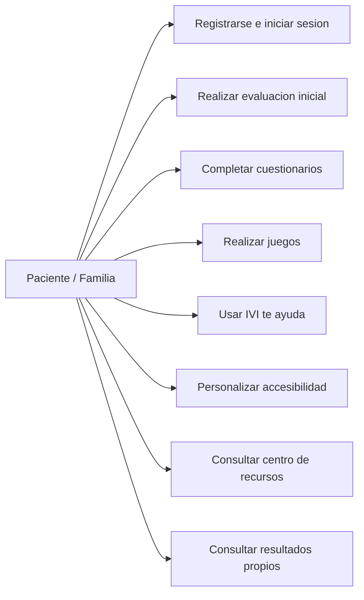

## Figura 6.5. Diagrama de casos de uso - Profesional

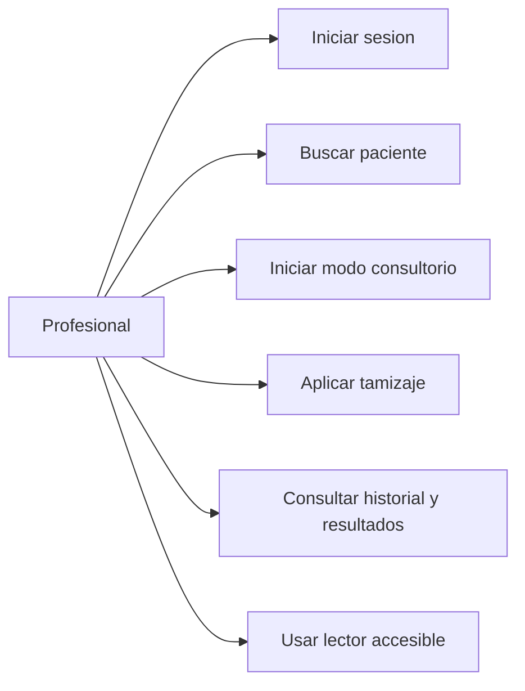

## Figura 6.6. Diagrama de casos de uso - Administrador

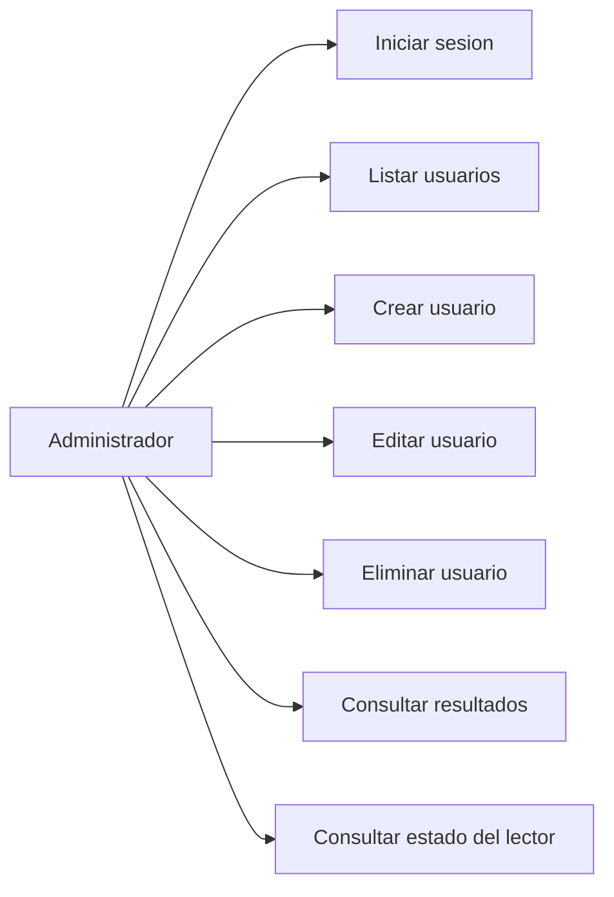

## Figura 6.7. Diagrama de secuencia - Proceso de tamizaje

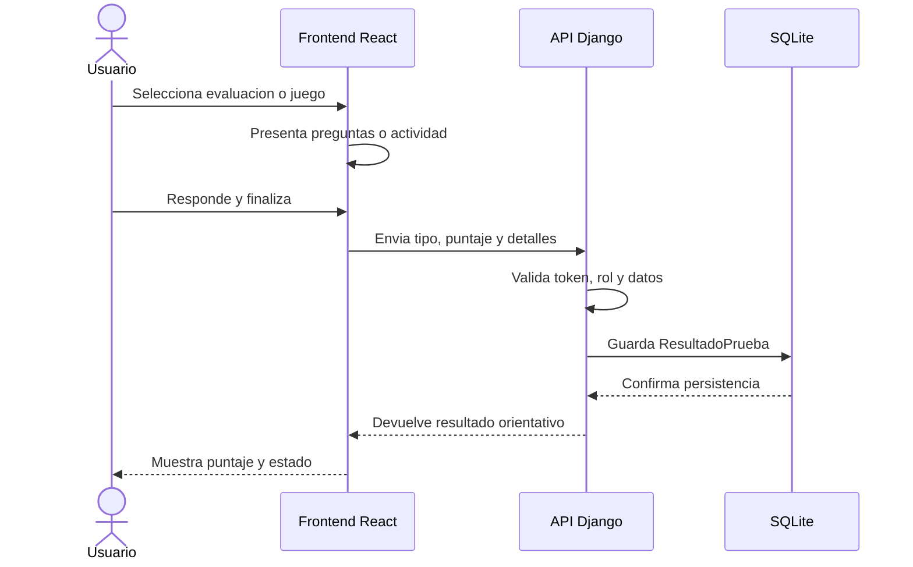

## Figura 6.8. Diagrama de secuencia - Carga de documentos

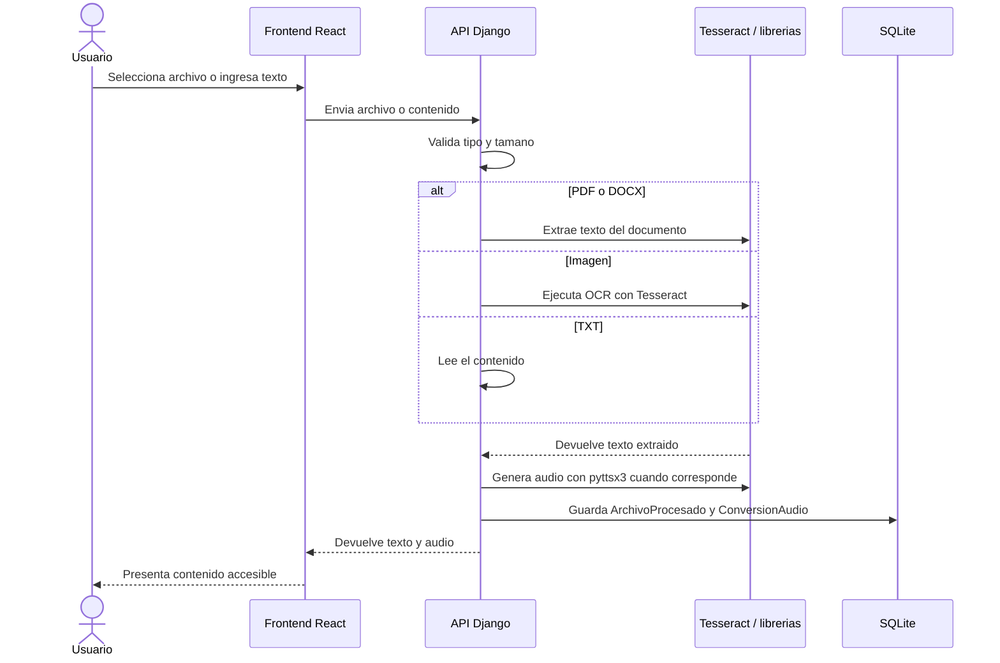

## Figura 6.9. Diagrama de actividades - Flujo de navegacion

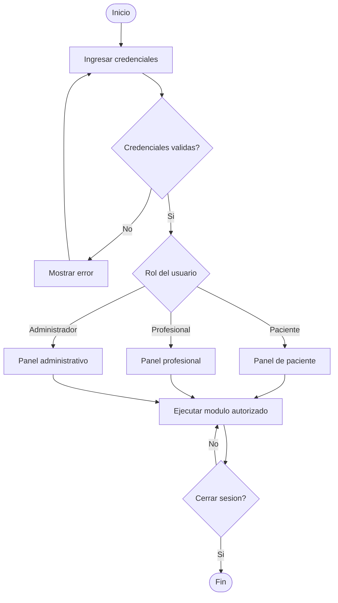

## Figura 6.10. Diagrama de clases

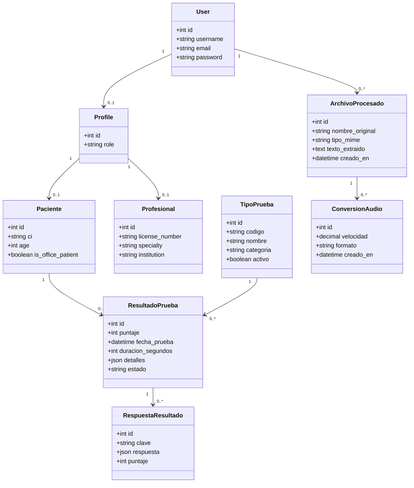

## Figura 6.11. Diagrama entidad-relacion (DER)

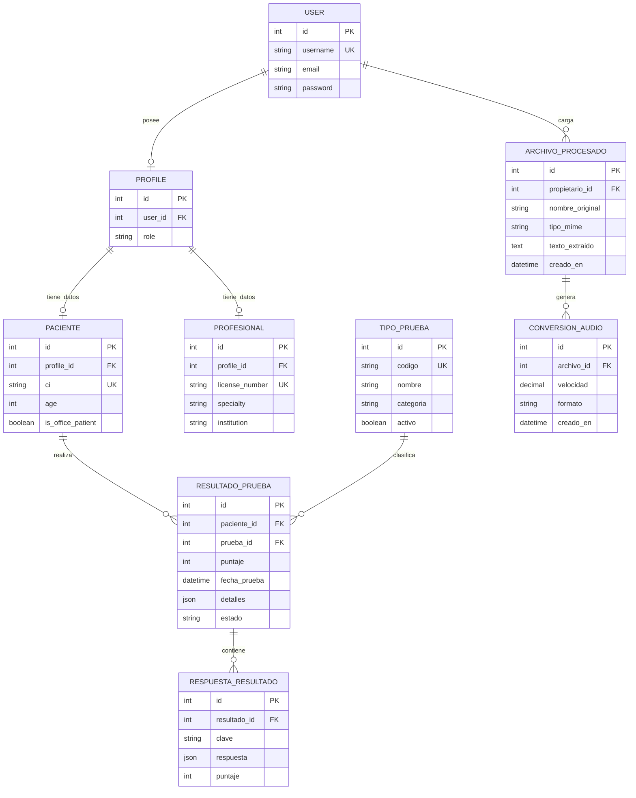

## Figura 6.12. Diagrama de arquitectura general

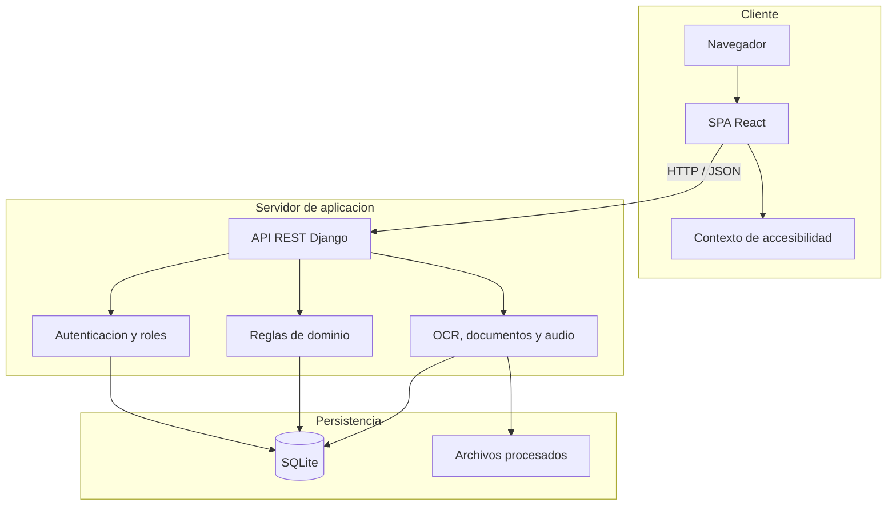

## Figura 6.13. Diagrama de despliegue

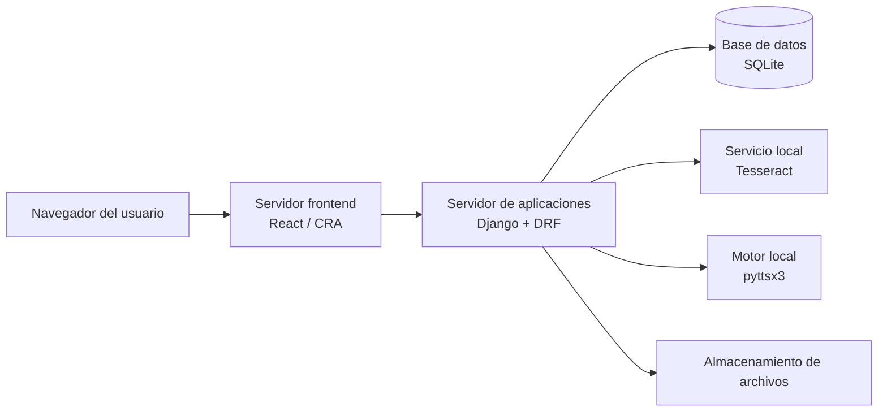

## Figura 6.14. Diagrama de arquitectura de red

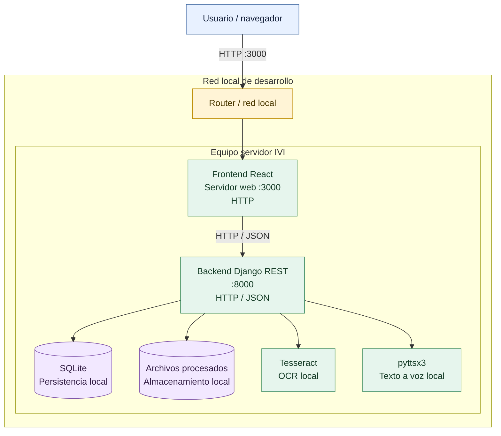

## Uso en la tesis

- Insertar cada diagrama como una figura independiente con el titulo indicado.
- Mantener el mismo nombre de actores, procesos y entidades en todos los diagramas.
- Exportar los bloques Mermaid a SVG o PNG antes de incorporarlos al documento final.
- Ubicar el DER y el diagrama de clases despues de explicar la arquitectura y antes de describir los modulos.
- Mantener los diagramas de nivel 2 y el modelo relacional detallado como anexos opcionales.

## Imagenes exportadas

Las versiones SVG listas para insertar en la tesis se encuentran en [diagramas_tesis](diagramas_tesis/):

1. [Figura 6.1 - Contexto nivel 0](diagramas_tesis/figura_6_1_diagrama_de_contexto_nivel_0.svg)
2. [Figura 6.2 - Flujo de datos nivel 1](diagramas_tesis/figura_6_2_diagrama_de_flujo_de_datos_nivel_1.svg)
3. [Figura 6.3 - Diagrama conceptual](diagramas_tesis/figura_6_3_diagrama_conceptual.svg)
4. [Figura 6.4 - Casos de uso Paciente/Familia](diagramas_tesis/figura_6_4_diagrama_de_casos_de_uso_paciente_familia.svg)
5. [Figura 6.5 - Casos de uso Profesional](diagramas_tesis/figura_6_5_diagrama_de_casos_de_uso_profesional.svg)
6. [Figura 6.6 - Casos de uso Administrador](diagramas_tesis/figura_6_6_diagrama_de_casos_de_uso_administrador.svg)
7. [Figura 6.7 - Secuencia de tamizaje](diagramas_tesis/figura_6_7_diagrama_de_secuencia_proceso_de_tamizaje.svg)
8. [Figura 6.8 - Secuencia de carga de documentos](diagramas_tesis/figura_6_8_diagrama_de_secuencia_carga_de_documentos.svg)
9. [Figura 6.9 - Actividades de navegacion](diagramas_tesis/figura_6_9_diagrama_de_actividades_flujo_de_navegacion.svg)
10. [Figura 6.10 - Diagrama de clases](diagramas_tesis/figura_6_10_diagrama_de_clases.svg)
11. [Figura 6.11 - Diagrama entidad-relacion](diagramas_tesis/figura_6_11_diagrama_entidad_relacion_der_.svg)
12. [Figura 6.12 - Arquitectura general](diagramas_tesis/figura_6_12_diagrama_de_arquitectura_general.svg)
13. [Figura 6.13 - Diagrama de despliegue](diagramas_tesis/figura_6_13_diagrama_de_despliegue.svg)
14. [Figura 6.14 - Arquitectura de red](diagramas_tesis/figura_6_14_diagrama_de_arquitectura_de_red.svg)
