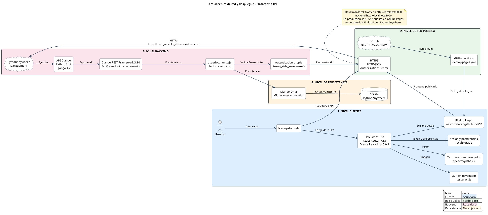

# Arquitectura de red y despliegue de la plataforma IVI

Fuente PlantUML del diagrama actualizado:

## Servicios representados

- Frontend React publicado en [GitHub Pages](https://nestorzalazar.github.io/IVI/).
- Backend Django REST alojado en [PythonAnywhere](https://danzgamer1.pythonanywhere.com).
- Código fuente en [GitHub](https://github.com/NESTORZALAZAR/IVI).
- Despliegue automático mediante GitHub Actions y `deploy-pages.yml`.
- Persistencia SQLite en PythonAnywhere.
- OCR con `tesseract.js` y texto a voz con `speechSynthesis`, ambos en el navegador.

La imagen SVG generada a partir de esta fuente se encuentra en
`06_ARQUITECTURA_REDES.svg`.
