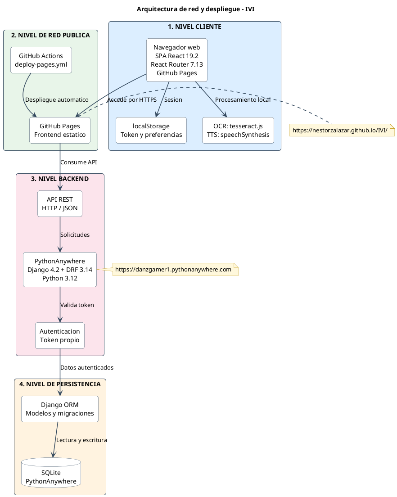

# Arquitectura de red y despliegue simplificada de IVI

Diagrama PlantUML reducido a los componentes esenciales de cliente, red
pública, backend y persistencia.

## Flujo principal

**Navegador web → GitHub Pages → API REST → PythonAnywhere → Django ORM →
SQLite.**

El frontend ejecuta localmente el OCR con `tesseract.js` y el texto a voz con
`speechSynthesis`. La autenticación utiliza un token propio enviado a la API.
