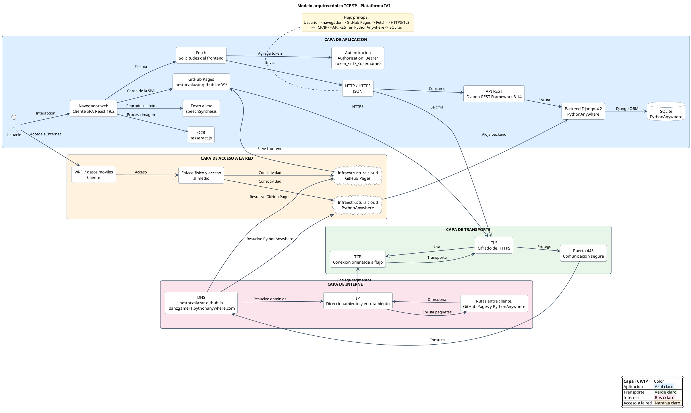

# Modelo arquitectónico TCP/IP de la plataforma IVI

Diagrama PlantUML del flujo de comunicación entre el navegador, GitHub Pages,
la API Django en PythonAnywhere y la base de datos SQLite.

## Tecnologías representadas

- **Aplicación:** HTTP/HTTPS, JSON, Fetch, API REST, React 19.2, Django 4.2,
  Django REST Framework 3.14, `tesseract.js` y `speechSynthesis`.
- **Transporte:** TCP y TLS para proteger la comunicación HTTPS.
- **Internet:** IP y DNS para resolver `nestorzalazar.github.io` y
  `danzgamer1.pythonanywhere.com`.
- **Acceso a la red:** Wi-Fi o datos móviles del cliente e infraestructura
  cloud de GitHub Pages y PythonAnywhere.
- **Persistencia:** SQLite alojado en PythonAnywhere.
