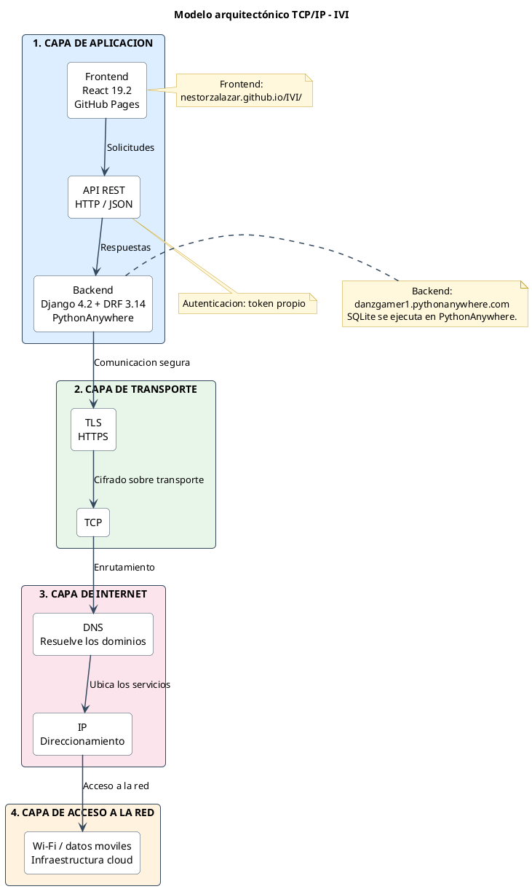

# Modelo TCP/IP simplificado de la plataforma IVI

Versión reducida del modelo arquitectónico TCP/IP, enfocada en los componentes
esenciales y en el flujo principal de comunicación.

El flujo simplificado es:

**Frontend React → API REST → Backend Django → TLS/HTTPS → TCP → DNS/IP →
red Wi-Fi o datos móviles → infraestructura cloud.**
